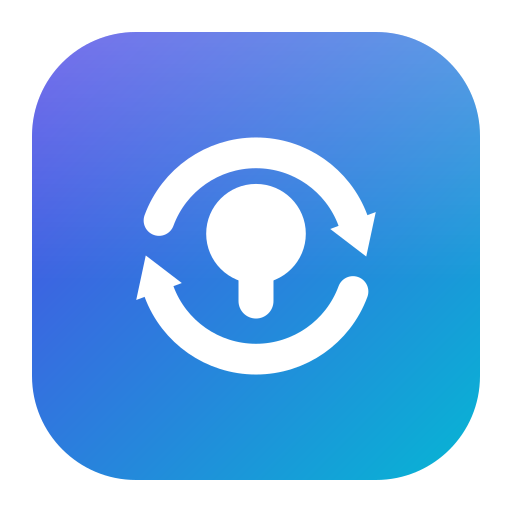

<div align="center">



# PodSwitch

**Make any Bluetooth headphones follow your sound across devices — like Apple's
AirPods auto‑switching, but for *any* headphones and *any* devices you choose.**


-06B6D4)


</div>

> [!NOTE]
> **About this project.** PodSwitch was **built with AI** (it was designed and
> written almost entirely through an AI coding assistant). It is **not a
> commercial product, there is no profit motive**, and it collects no data. It
> started as a personal itch — wanting earbuds to follow audio between a Mac and an
> Android phone the way AirPods do between Apple devices — and since nothing online
> did exactly that, it was built. It now lives here publicly in case it's useful to
> someone else. Use it at your own risk.

## What it is

Apple's AirPods seamlessly hop between Apple devices when audio starts playing —
but only between Apple devices signed into the same account. Against a Windows PC,
an Android phone, or any non‑Apple setup, your earbuds are just plain Bluetooth
headphones with no automatic switching. And this isn't an AirPods problem: most
single‑point Bluetooth headphones can only stream to one device at a time and
won't follow you.

**PodSwitch fixes that in software.** When audio starts on a device, that device
grabs the headphones. It works with **any** Bluetooth audio device (earbuds,
headphones, speakers) and across **any** devices you run it on — a **macOS** Mac, an
**Android** phone, and a **Windows** PC. Think of it as DIY "multipoint" that you
control, for hardware that doesn't have it.

After researching the landscape, nothing did this exact job — audio‑triggered,
cross‑ecosystem, for arbitrary headphones, with a policy you choose. Native
auto‑switch is Apple‑only; real multipoint is locked to specific headphone brands.
So PodSwitch fills a genuinely empty niche.

## Features

- 🎧 **Works with any Bluetooth audio device** — not tied to AirPods or any brand.
- 🔀 **Audio‑triggered hand‑off** — the headphones follow wherever sound starts.
- ⚙️ **Two modes, per device:** **Steal** (switch automatically) or **Ask**
  (notify first, switch only if you tap).
- 🗂️ **Category filter (Android):** trigger on **Media**, **Calls**, and/or
  **Notifications** independently.
- ✅ **Real verification:** after connecting it confirms the device actually
  connected, retries once, then fails **silently** — no nagging error pop‑ups.
- 🧭 **Lives where you expect it:** a **menu‑bar** item on macOS, a **Quick Settings
  tile** + config screen on Android, and a **system‑tray** app on Windows.
- 🔋 **Battery‑friendly** — see *How it works*; it's event‑driven, not polling.
- 🚫 **No account, no network, no telemetry.** Each device acts on its own.

## How it works (the interesting part)

PodSwitch is deliberately **event‑driven (listener‑based), not polling** — it
sleeps until the OS tells it something happened, so it costs almost nothing at
idle.

- **Detecting audio (listeners, no polling):**
  - **macOS** watches the per‑process Core Audio output state
    (`kAudioProcessPropertyIsRunningOutput`) for *what's playing*, plus the system
    **Now Playing** play/pause state (via `MediaRemote`) so a *pause* is caught
    instantly rather than lingering. (On macOS 13, before the per‑process API
    existed, it falls back to a single default‑output‑device listener.)
  - **Android** uses `AudioManager.registerAudioPlaybackCallback`; call state is
    read on‑demand from `AudioManager.getMode()` (not polled).
  - **Windows** uses WASAPI audio‑session notifications (`IAudioSessionEvents`) on
    the default render device.
  - All transitions are debounced so the engine sees one clean *idle→playing* event.
- **A shared, pure decision engine.** Every platform implements the *same* pure
  function `decide(event, config, status) → action`. It has no side effects and is
  exhaustively unit‑tested (every mode × category × state) on all three. All platform
  I/O lives behind small interfaces, so the logic is identical everywhere.
- **Grabbing the device.** Because single‑point Bluetooth only streams to one host,
  "stealing" just means force‑connecting on the active side; the other side drops
  automatically — **no cross‑device coordination, no server, no network.**
  - **macOS:** `IOBluetooth` opens the connection; verified via the routed output.
  - **Android:** the A2DP profile is connected via the framework, verified against
    `BluetoothProfile.STATE_CONNECTED`.
  - **Windows:** no direct API exists, so it **toggles the device's audio service**
    (`BluetoothSetServiceState` disable→enable) and sets it as default output — which
    is why Windows is slower (see *Switch speed*).
- **Verify → retry once → silent.** A connect attempt is verified asynchronously
  (non‑blocking). If it doesn't take, it retries **once**, then gives up quietly.
  Failures never interrupt you.
- **Staying alive.** macOS runs as a `launchd` agent; Android runs a foreground
  service (restarts on boot); Windows runs from the tray (optional start‑at‑login).

## Compatibility

| Platform | Minimum | Notes |
|---|---|---|
| **macOS** | 13 (Ventura) | Menu‑bar agent, unsigned `.app`; **14+ recommended** for instant pause detection |
| **Android** | 8.0 / API 26 | Foreground service; adaptive icon; Quick Settings tile |
| **Windows** | 10 / 11 | System‑tray app, unsigned `.exe`; slower switch (see below) |

> [!WARNING]
> **This may break on future OS updates.** PodSwitch leans on platform behavior that
> vendors can change without notice — Android's hidden A2DP connect path (reflection),
> macOS's CoreAudio/IOBluetooth routing and its `MediaRemote` Now Playing read, and
> Windows' `BluetoothSetServiceState` / `IPolicyConfig` calls. A future Android, One UI,
> macOS, or Windows release could change or restrict these. It degrades safely (stops) rather than crashing, but no
> forward compatibility is guaranteed.

## Switch speed

| Platform | How it connects | Typical switch time |
|---|---|---|
| **macOS** | `IOBluetooth.openConnection()` — direct device connect | **1–2 s** |
| **Android** | `BluetoothA2dp.connect()` — direct A2DP profile connect | **1–2 s** |
| **Windows** | `BluetoothSetServiceState` service toggle (no direct API) | **~5–10 s** |

macOS and Android each have a *direct* "connect this Bluetooth audio device" API and
stacks optimized for it (phones connect headphones constantly), so the hand‑off is
near‑instant. **Windows has no such API** — the only way to connect a paired A2DP
device is to *toggle its audio service* (disable → settle → enable), which forces
Windows to reconnect the whole device through the driver. That negotiation physically
takes several seconds, so **most of the ~5–10 s is Windows connecting the device, not
PodSwitch** — it's close to the floor of what Windows allows.

## Install

Grab the prebuilt files from the [latest release](../../releases/latest):

- **Android** — download the `.apk` and install it (enable "install unknown apps").
  Then open PodSwitch, grant **Nearby devices** and **Notifications**, pick your
  headphones, choose a mode, and **exempt it from battery optimization** (Settings →
  Apps → PodSwitch → Battery → Unrestricted) so Android doesn't kill the service.
- **macOS** — download the `.dmg`, drag `PodSwitch.app` to Applications. It is
  **unsigned**, so the first launch needs right‑click → **Open** to get past
  Gatekeeper. It appears in the menu bar (no Dock icon).
- **Windows** — download `PodSwitch-windows-0.1.0.exe` (self‑contained,
  no .NET install needed). It's **unsigned**, so SmartScreen warns → **More info → Run
  anyway**. It runs in the system tray. Expect a ~5–10 s switch (see *Switch speed*).

## Build from source

**macOS** (Xcode 15+ / Swift 6):

```sh
cd macos
swift build && swift test     # builds + runs the unit tests
./Scripts/package.sh          # assembles build/PodSwitch.app
```

**Android** (Android Studio, or the CLI with a JDK 17 — AGP 8.7 does not run on JDK 25+):

```sh
cd android
JAVA_HOME=/path/to/jdk-17 ./gradlew :app:testDebugUnitTest   # unit tests
JAVA_HOME=/path/to/jdk-17 ./gradlew assembleDebug            # -> app/build/outputs/apk/debug/
```

**Windows** *(build on Windows with the .NET 8 SDK or Visual Studio 2022):*

```powershell
cd windows
dotnet test PodSwitch.Core.Tests          # engine tests (run on any OS)
dotnet publish PodSwitch.App -c Release -r win-x64 --self-contained `
  -p:PublishSingleFile=true -p:IncludeNativeLibrariesForSelfExtract=true
```

## Usage

- **Pick the target device** from your paired/bonded Bluetooth devices.
- **Choose a mode:** *Switch automatically* (Steal) or *Ask me first* (Ask).
- **Android only:** tick which audio categories should trigger a switch.
- **Android Quick Settings tile:** pull down the shade → edit → add the *PodSwitch*
  tile to toggle the mode without opening the app.
- **macOS menu bar / Windows system tray:** enable/disable, pick the mode, choose the
  device (and on Windows, optionally start at login).

## Known limitations

- **Single‑active by design.** Whichever device connects wins and the other drops —
  that's how the hand‑off works, and it's why no coordination is needed.
- **Not instant.** A Bluetooth reconnect takes ~1–3 s on macOS/Android and ~5–10 s on
  Windows, so you may lose the first moment of audio when it switches. This is a
  property of Bluetooth (and, on Windows, the lack of a direct connect API) — not the app.
- **Android hidden API.** Connecting the A2DP profile uses an unofficial reflective
  call; it's isolated, but it's the most fragile part on Android.
- **Windows is slower** and uses a service‑toggle workaround (see *Switch speed*); on
  some PCs the device connects but the default output may not switch (then enable
  Windows' "switch to new audio devices automatically").
- **Device matching** on macOS/Windows relies on the system output device name
  matching the Bluetooth device name.

## Project status

Personal, single‑maintainer, **v0.2.1**. The shared decision engine is fully
unit‑tested on all three platforms (macOS, Android, Windows). macOS and the Windows
connect are validated on real hardware (the Windows switch is just slower — see
*Switch speed*). Issues and PRs are welcome but support is best‑effort.

## License

[MIT](LICENSE), © 2026 Felip6499. Use, modify and redistribute it freely — the one
condition is the standard MIT one: **keep the copyright and license notice** in any
copies or substantial portions, so credit travels with the code. If you build on
PodSwitch in another project, a mention or link back is genuinely appreciated
(not legally required beyond keeping the notice).

## Acknowledgements

Designed and implemented with the help of an **AI coding assistant**. Built out of
necessity, shared in case it helps someone else.
